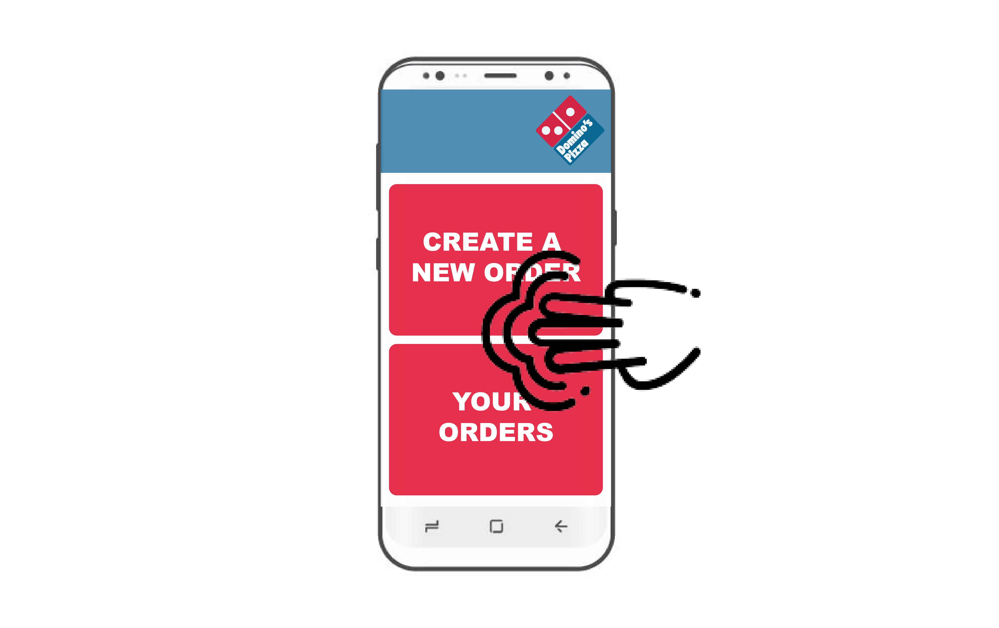
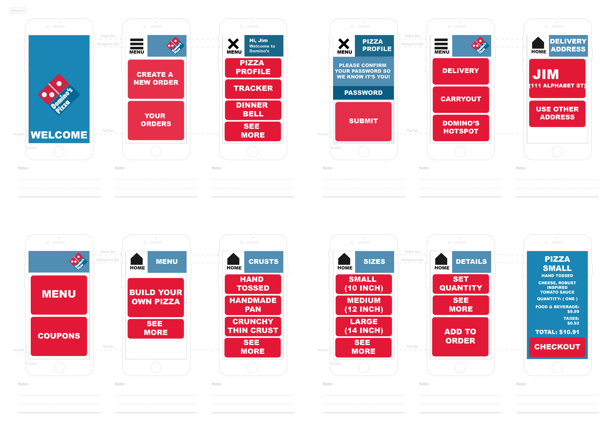

# Dominos App for the Visually Impaired.

## Visual Overview

### Voice Assistant Hidden Element Overview Readout

### Application Screen Mockups

## Context

### Prototype

This Web Application Prototype built in Angular 8 is based on the Personas Limitation Spectrum from the Inclusive Design Methodology.

### Example of a Live Use Case

According to the document 

	20190613153319483_DominosPetition.pdf 

located in this repository, in the case between Domino's Pizza LLC vs Guillermo Robles states the question:

	Whether Title III of the ADA requires a website
	or mobile phone application that offers goods or services
	to the public to satisfy discrete accessibility requirements
	with respect to individuals with disabilities?

### Hypothesis Driven Design

The following are hypotheses, experiments, and evidence according to the hypothesis driven design process. 

Hypothesis: Increasing the size of the elements of the Dominos Application will increase usability and visability.

Experiment: Testing this application on individuals with Visual Impairment.

Evidence: The hypothesis is correct when the individuals who normally can not order from Domino's can order using the elements of increased size.

### Design Constraints and Platform Features

The near certain usage of Voice Assistant on Android devices and Vision Accessibility for iOS devices, constrain the design of the application. 

Additionally, design details that are purely aesthetic will be of increased difficulty for Personas Limitation Spectrum with Visual Impairment to see. 

### Implementation of a hidden element component in the Angular 8 Prototype. 

The hidden component is located in the home.component.html file as a div with the class = hidden. 

	home.component.html

	

	Welcome Jim to Domino's Pizza. 
	This is the home screen. 
	You can select 
	1. Create a new order. 
	2. Your Orders. 
	The two options are stacked on top of each other. 
	Equal spaced in the center of the screen.

	

The corresponding style sheet is located in the same folder named home.component.css and has a class named hidden which is styled in a way to hide the element visually but is still seen by the Voice Assistant and so is read out first.

	home.component.css

	.hidden {

	position:absolute;
	left:-10000px;
	top:auto;
	width:1px;
	height:1px;
	overflow:hidden;

	}

The Voice Assistant functionality of the Samsung S10 5G device can be used by tapping three fingers on the screen.

When the user taps with three fingers all the elements will be read by Voice Assistant.

## Source Code

The source code for the prototype is located in

	/source_code/prototype

