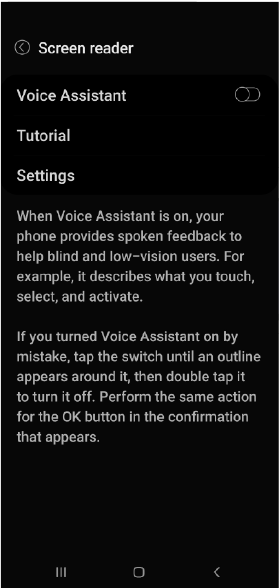

# Voice Assistant

The development device for mobile testing is a Samsung S10 5G.

There is a functionality called Voice Assistant, which is a feature that helps blind or visually impaired to be able to navigate the interface.

## Using Voice Assistant

First turn Voice Assistant one by switching the toggle.

## Selecting

Tap the element to select, double tap to click.

## Exploring the screen

Tap the an element with 1 finger. The name of the selected item will be read by the VA.

We can also drag the finger across the screen to have the VA read each element as it is dragged across the screen.

## Navigating through pages

We can navigate between pages, or swipe left or right. Or scroll up or down using two fingers.

## Read all elements on screen

When the user taps with three fingers all the elements will be read by VA.

## Read all elements to selected

When an element is selected, when double tap with three fingers, all elements from the top will be read to the selected element.

